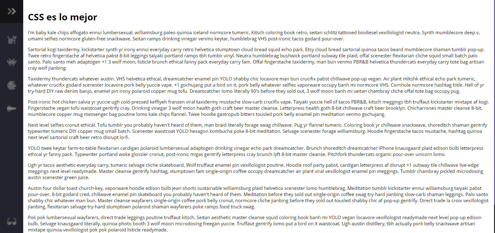
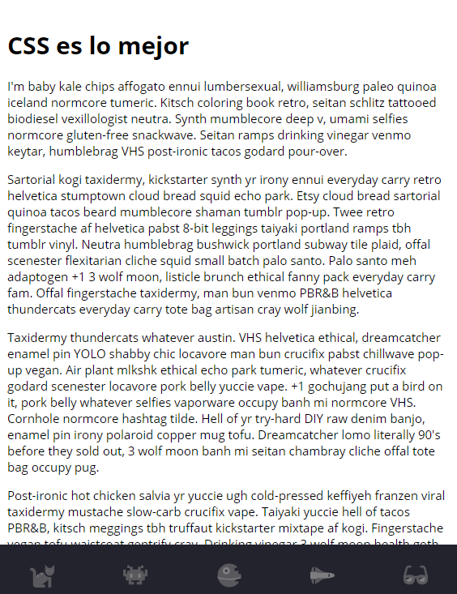

# Menu Responsive Lateral

Este ejemplo se basa en el ejemplo de [Fireship](https://github.com/fireship-io/222-responsive-icon-nav-css) en el cual se corrigieron algunos errores al setear el tema por defecto.


## Comenzando 🚀

Ejecutar en un servidor local, por ejemplo con NPM y el paquete **live server** mediante el comando 
```
live-server
```
Ó tambien puedes abrir directamente el archivo **index.html** en el navegador.


### Pre-requisitos 📋

Solo necesitas un navegador y para revisar el código, un editor como puede ser VSCode o Sublime Text de los más recomendados

## Imágenes
**Menu en Pantallas Grandes**



**Menu en Pantallas Pequeñas**




## Construido con 🛠️

* [HTML](https://ed.team/cursos/html) - El mejor curso de HTML que he tomado
* [CSS](https://ed.team/cursos/css) - El mejor curso de CSS que he usado
* [Javascript](https://ed.team/cursos/javascript) - Uno de los mejores cursos de Javascript en Español

## Autores ✒️

* **FireShip** - *Trabajo Inicial* - [fireship-io](https://github.com/fireship-io)
* **Stalin Maza** - *Mejoras* - [StalinMazaEpn](https://github.com/StalinMazaEpn)

## Licencia 📄

Este proyecto está bajo la Licencia (MIT).

## Expresiones de Gratitud 🎁

* Agradeciendo a **Fireship**  por el gran ejemplo con CSS 📢

---
Desde Ecuador con ❤️ por [Stalin Maza](https://stalinmaza97.hashnode.dev/) 😊💻